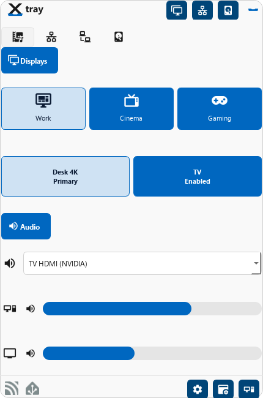
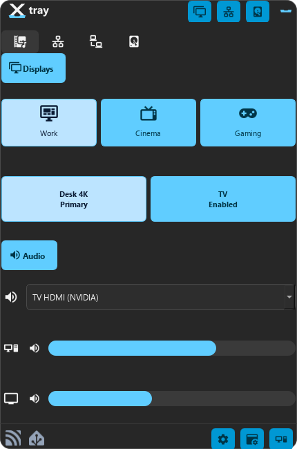
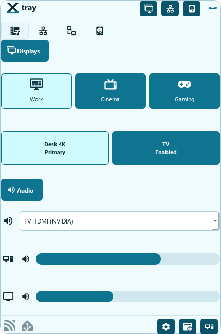
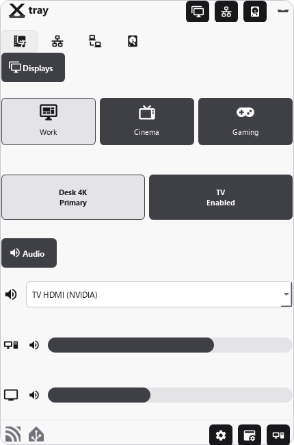
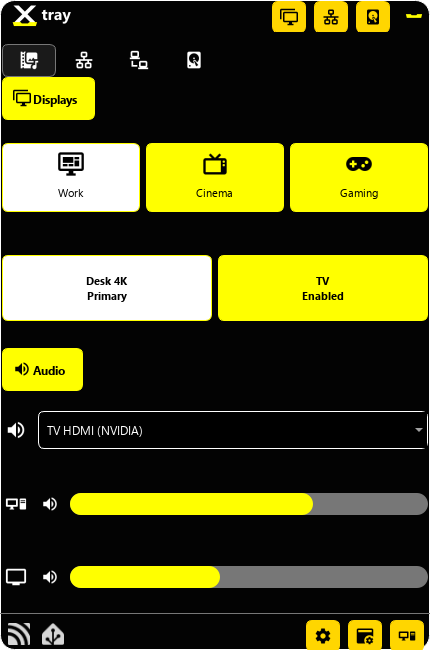

# XTray

XTray e' un'app Windows per la system tray che mette in un solo pannello i
controlli quotidiani del PC: profili monitor, audio, volume, adattatori di
rete, drive, dispositivi di rete e integrazione Home Assistant.

L'idea e' semplice: apri l'icona nella tray, cambi assetto del computer in pochi
click e torni a lavorare senza aprire mille finestre di Windows.

## Screenshot e temi

| Vibrant | Dark |
| --- | --- |
|  |  |

| Ocean | Graphite |
| --- | --- |
|  |  |

| High Contrast |
| --- |
|  |

## Installazione

### Installer Windows

1. Apri la pagina [Releases](https://github.com/Phos69/XTray-Production/releases).
2. Scarica `XTray-Setup-<version>.exe` dalla release piu' recente.
3. Esegui l'installer. Non serve installare Python.
4. Se vuoi, abilita l'opzione `Start XTray with Windows`.
5. Avvia XTray dal menu Start e usa l'icona nella system tray.

L'installazione e' per singolo utente e usa:

- app: `%LOCALAPPDATA%\Programs\XTray`
- impostazioni: `%APPDATA%\XTray\settings.json`
- log: `%LOCALAPPDATA%\XTray\logs\`

Se la pagina Releases e' vuota, significa che e' stato pubblicato il codice
sorgente ma non ancora un installer. In quel caso puoi usare l'avvio da sorgente
qui sotto.

### Avvio da sorgente

Richiede Windows e Python 3.11+.

```powershell
git clone https://github.com/Phos69/XTray-Production.git
cd XTray-Production

py -m venv .venv
.\.venv\Scripts\python.exe -m pip install --upgrade pip
.\.venv\Scripts\python.exe -m pip install `
  -e .\packages\computer_manager `
  -e .\packages\network_manager `
  -e .\packages\xtray[full]

.\.venv\Scripts\xtray-tray.exe
```

## Aggiornamenti

Le build installate con `XTray-Setup-<version>.exe` controllano
automaticamente le nuove release pubbliche di `Phos69/XTray-Production`.

Quando una release piu' recente contiene un asset
`XTray-Setup-<version>.exe`, XTray puo' scaricarlo, chiudersi, lanciare
l'installer in modalita' silenziosa e riaprirsi dopo l'update. Dal menu tray
puoi anche usare `Check for Updates` per controllare manualmente.

Variabili utili:

- `XTRAY_DISABLE_UPDATE_CHECKS=1`: disattiva il controllo automatico.
- `XTRAY_UPDATE_REPO=owner/repo`: usa un'altra repo pubblica per le release.

## Funzionalita principali

### Tray rapido

- Applica profili display preferiti, ad esempio lavoro, gaming o TV.
- Vede i monitor collegati e mostra primario, abilitato, disabilitato o non
  disponibile.
- Cambia uscita audio e controlla volume/mute del PC.
- Controlla il volume di monitor HDMI o entita' `media_player` Home Assistant,
  quando configurate.
- Mostra adattatori di rete, drive e dispositivi salvati in Network Manager.
- Include indicatori Home Assistant e MQTT.
- Permette di aprire Options, Computer Manager e Network Manager dalla tray.

### Computer Manager

- Gestione profili monitor.
- Inventario display con dati DDC/CI quando il monitor li espone.
- Controllo output audio Windows.
- Gestione adattatori di rete: stato, IPv4, DHCP, gateway, DNS e proprieta'.
- Vista drive locali e di rete, con spazio libero e collegamento rapido.

### Network Manager

- Rubrica dispositivi di rete con nome, IP, MAC, URL e icona.
- Ping rapido e apertura del dispositivo nel browser.
- Scansione locale per trovare dispositivi sulla rete.
- Finestra Device dedicata per consultare e modificare i dispositivi salvati.

### Home Assistant

- Integrazione REST per leggere e impostare volume/mute delle entita'
  `media_player`.
- Pubblicazione MQTT Discovery per esporre controlli e stati a Home Assistant.
- Servizi opzionali per accendere o spegnere display tramite automazioni Home
  Assistant.

### Personalizzazione

- Temi integrati: Vibrant, Dark, Ocean, Graphite, High Contrast e varianti colore
  chiare/scure.
- Icone configurabili per azioni, profili e dispositivi.
- Tab, pulsanti e sezioni della tray configurabili dalle Options.
- Avvio automatico con Windows tramite installer o menu dell'app.

## Creare un installer

Se stai lavorando dal sorgente e vuoi generare un installer locale:

```powershell
.\.venv\Scripts\python.exe -m pip install `
  -e .\packages\computer_manager `
  -e .\packages\network_manager `
  -e .\packages\xtray[build]
.\scripts\build_installer.ps1
```

Il file viene creato in `dist\installer\XTray-Setup-<version>.exe`.

## Note utili

- Alcune funzioni dipendono dall'hardware: DDC/CI, volume HDMI e stati monitor
  sono disponibili solo se Windows e il monitor li espongono.
- Le azioni su display, audio, adattatori e drive modificano impostazioni reali
  del PC: prova i profili monitor su una configurazione che puoi recuperare
  manualmente.
- Le password salvate da Network Manager usano Windows Credential Manager con
  servizio `Network_Manager`.
- I log e i diagnostici si trovano in `%LOCALAPPDATA%\XTray\logs\`.

## Licenza

Vedi [LICENSE](LICENSE).
